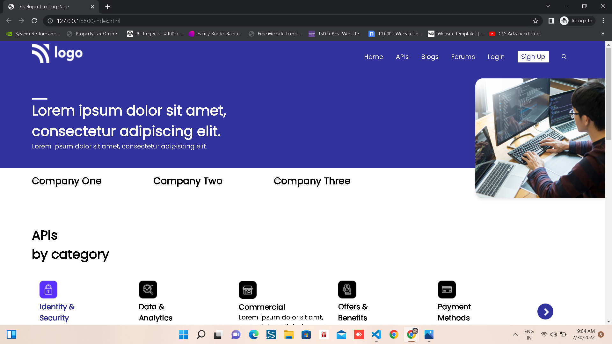
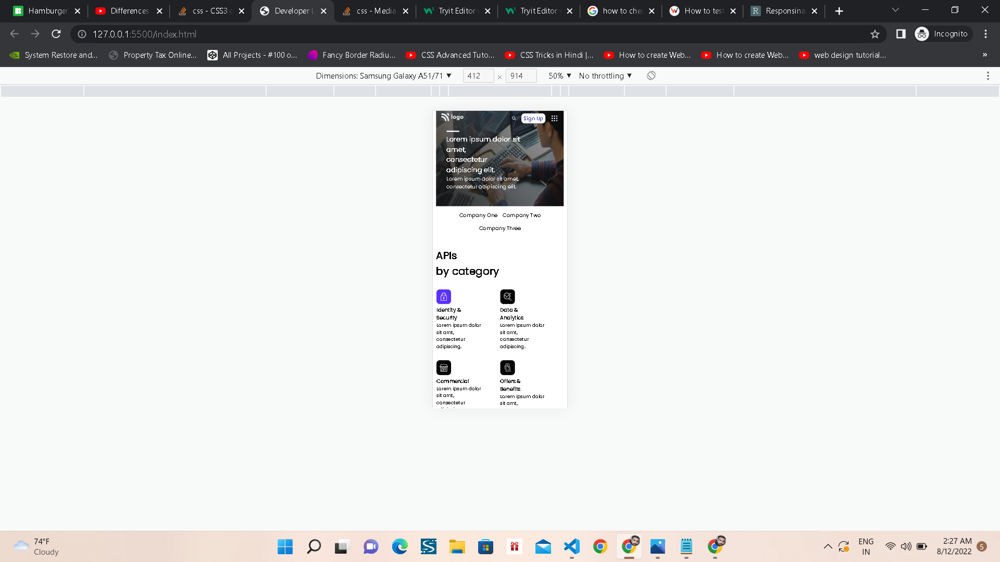

# **Project-09 Developer Landing Page** 

## _Name : ADITYA BANKAR_

## ABOUT PAGE 

> In this project i learnt about how to make whole landing page responsive using media queries. How it works . 
I learnt about positioning, flexbox, min-width and max-width.
1. Transitioning
2. Grid/ Flex
3. max-width/ min-width

## Time Taken

>It was fun making this website, and i took 9 hrs to complete the project.

